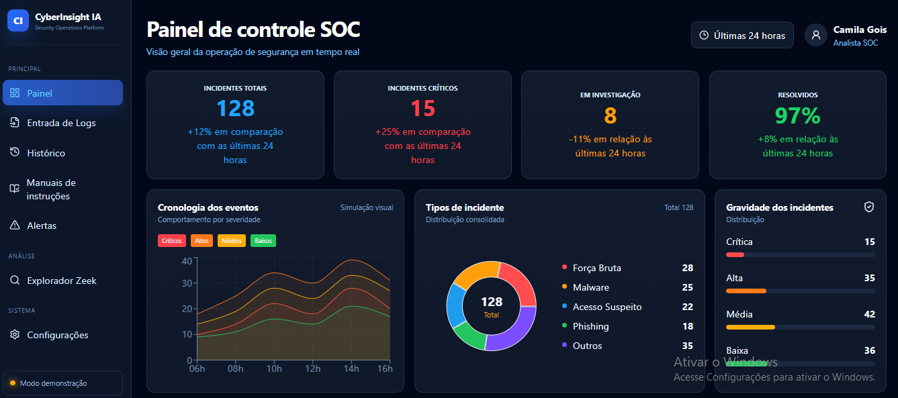
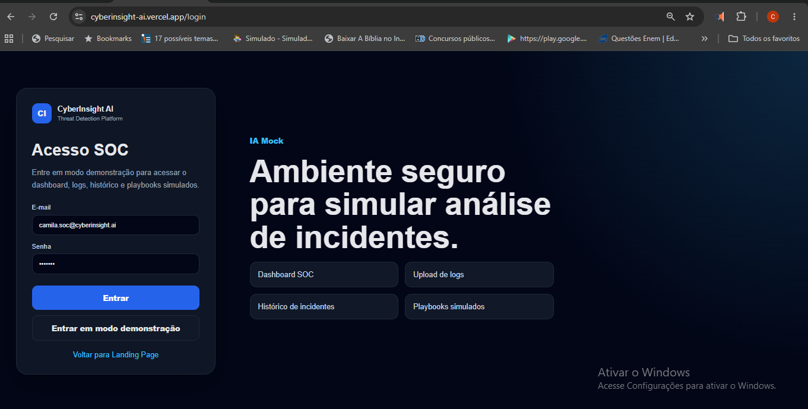
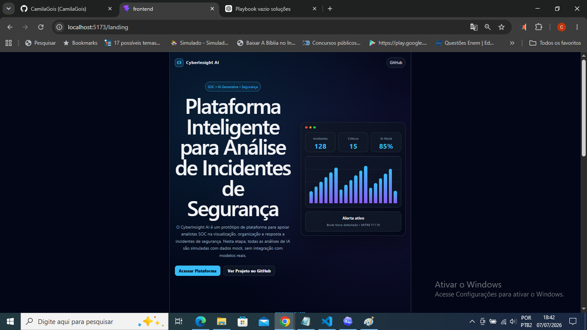
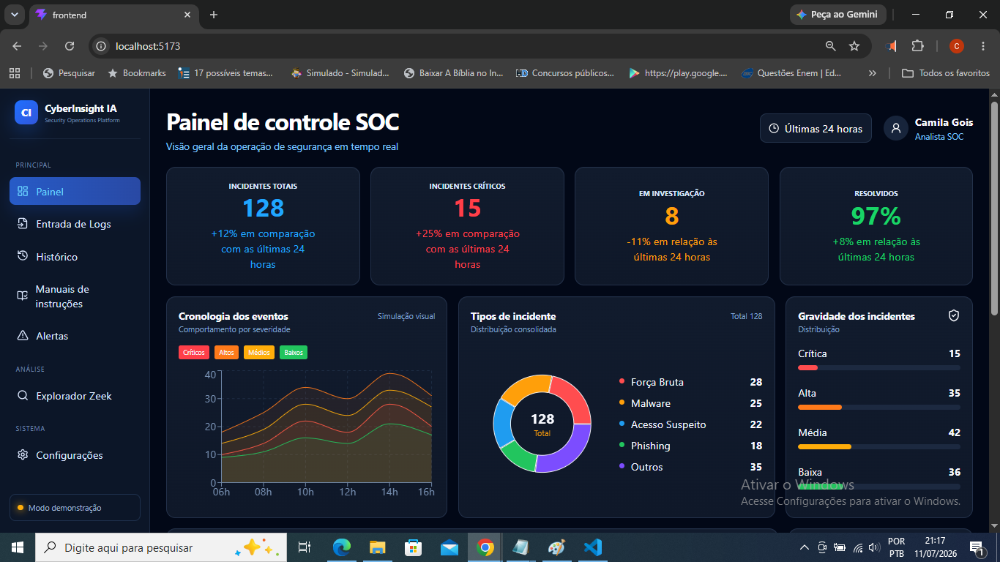
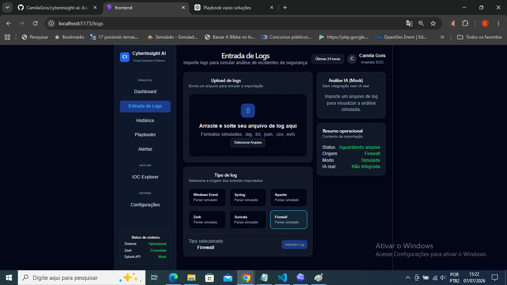
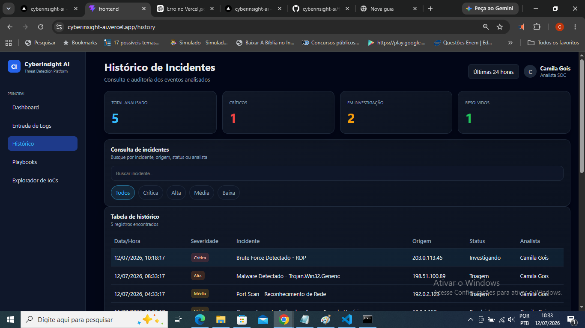
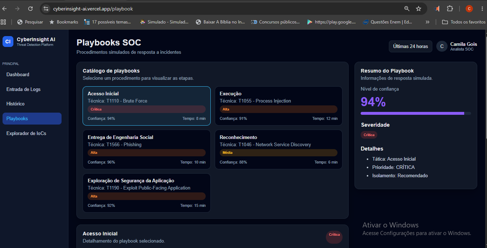
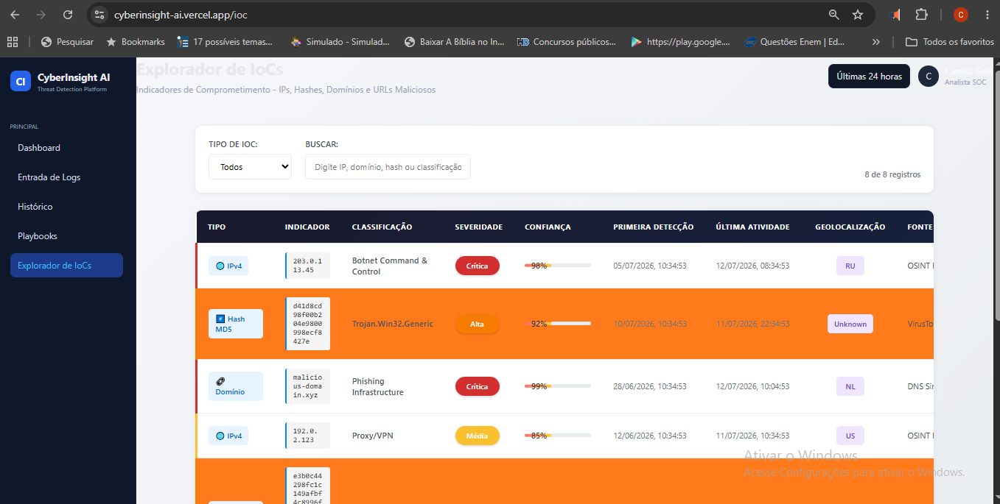

<p align="center">
  
</p>


# 🛡️ CyberInsight AI

> Plataforma de apoio a Analistas SOC para análise de incidentes de segurança, correlação de eventos e geração de respostas simuladas utilizando conceitos de Inteligência Artificial Generativa.


---

## 📖 Sobre o Projeto

O **CyberInsight AI** é um protótipo de uma plataforma para apoio a Analistas de Segurança (SOC – Security Operations Center), desenvolvido como parte da **Avaliação Intermediária da disciplina de IA Generativa**.

A aplicação simula o fluxo de análise de incidentes cibernéticos por meio de uma interface moderna, permitindo visualizar indicadores operacionais, importar logs, consultar incidentes, acessar playbooks e acompanhar eventos de segurança.

Nesta etapa do projeto **não foi integrado nenhum modelo de Inteligência Artificial**. Todas as funcionalidades relacionadas à IA utilizam respostas simuladas (*mock*), conforme previsto no edital da avaliação.

A arquitetura foi planejada para permitir futura integração com modelos de IA Generativa, mantendo separação entre frontend, backend e camada de serviços inteligentes.

---

# 📑 Índice

- [Objetivo](#-objetivo)
- [Problema](#-problema)
- [Funcionalidades](#-funcionalidades)
- [Arquitetura da Aplicação](#-arquitetura-da-aplicação)
- [Tecnologias Utilizadas](#-tecnologias-utilizadas)
- [Estrutura do Projeto](#-estrutura-do-projeto)
- [Como Executar](#-como-executar)
- [API REST](#-api-rest)
- [Uso de Agentes de Codificação](#-uso-de-agentes-de-codificação)
- [Processo de Desenvolvimento](#-processo-de-desenvolvimento)
- [Dificuldades Encontradas](#-dificuldades-encontradas)
- [Lições Aprendidas](#-lições-aprendidas)
- [Trabalhos Futuros](#-trabalhos-futuros)
- [Autor](#-autor)

---

# 🚀 Demonstração

| Recurso | Link |
|---------|------|
| 🌐 Aplicação Pública | https://cyberinsight-ai.vercel.app |
| 📂 Repositório GitHub | https://github.com/CamilaGois/cyberinsight-ai |
| 📑 ReDoc | https://cyberinsight-ai.vercel.app/redoc |
| 🔐 API de Incidentes | https://cyberinsight-ai.vercel.app/api/incidents/ |
| 💻 Frontend Local | http://localhost:5173 |
| ⚙️ Backend Local | http://127.0.0.1:8000 |

---

# 🖼️ Principais Telas

> As imagens abaixo representam a interface desenvolvida durante esta etapa do projeto.


## Login 

<p align="center">

</p>

## Landing Page 

<p align="center">

</p>

## Dashboard SOC

<p align="center">

</p>

---

## Entrada de Logs

<p align="center">

</p>

---

## Histórico

<p align="center">

</p>

---

## Playbooks

<p align="center">

</p>

---

## Explorador de IOC

<p align="center">

</p>

---

# 🎯 Objetivo

O objetivo do CyberInsight AI é fornecer uma plataforma de apoio à operação de um Centro de Operações de Segurança (SOC), centralizando informações sobre incidentes de segurança e preparando a arquitetura para futura integração com modelos de Inteligência Artificial Generativa.

O sistema foi desenvolvido para demonstrar como uma interface moderna pode auxiliar analistas de segurança durante o processo de triagem, investigação e resposta a incidentes, reduzindo o tempo necessário para localizar informações relevantes e apoiar a tomada de decisão.

Embora esta versão utilize dados simulados (*mock*), toda a estrutura foi planejada para integração futura com serviços inteligentes capazes de:

- classificar incidentes automaticamente;
- resumir logs de segurança;
- sugerir procedimentos de resposta;
- gerar playbooks automaticamente;
- mapear eventos ao framework MITRE ATT&CK.

---

# ⚠ Problema

Analistas SOC lidam diariamente com grandes volumes de alertas provenientes de diferentes ferramentas de monitoramento, como SIEM, EDR, IDS e Firewalls.

Grande parte do tempo operacional é consumida na análise manual desses eventos, tornando o processo repetitivo e sujeito a falhas humanas.

O CyberInsight AI foi concebido para centralizar essas informações em uma única plataforma, permitindo organizar incidentes, acompanhar indicadores operacionais e preparar a aplicação para futuras funcionalidades baseadas em Inteligência Artificial Generativa.

Nesta entrega, conforme previsto no edital da disciplina, as análises produzidas pela IA são simuladas, permitindo validar toda a navegação e experiência do usuário sem utilizar modelos reais de linguagem.

---

# 🏗️ Arquitetura da Aplicação

O CyberInsight AI foi desenvolvido utilizando uma arquitetura em camadas, permitindo separação entre interface, regras de negócio, API e futura camada de Inteligência Artificial.

```
                        Usuário
                           │
                           ▼
              Frontend (React + TypeScript)
                           │
                           ▼
                 Backend (FastAPI REST)
                           │
                           ▼
                 Banco de Dados (SQLite)
                           │
                           ▼
      IA Generativa (Integração Futura)
```

A separação das camadas facilita:

- manutenção do código;
- reutilização de componentes;
- escalabilidade da aplicação;
- integração futura com modelos de IA;
- testes independentes entre frontend e backend.

---

## Frontend

O frontend concentra toda a experiência do usuário da aplicação.

Principais responsabilidades:

- Dashboard SOC;
- Entrada de Logs;
- Histórico de Incidentes;
- Playbooks;
- KPIs;
- Navegação;
- Interface Responsiva.

---

## Backend

O backend foi desenvolvido utilizando FastAPI para disponibilizar APIs REST responsáveis pela comunicação com o frontend.

Nesta etapa da avaliação, a API fornece os dados necessários para demonstração das funcionalidades implementadas.

---

## Banco de Dados

Foi adotado SQLite como banco de dados local devido à sua simplicidade, facilidade de distribuição e baixa necessidade de configuração.

Essa escolha permite que o projeto seja executado rapidamente em ambiente acadêmico sem dependências externas.

---

# 🚀 Funcionalidades

O CyberInsight AI disponibiliza um conjunto de funcionalidades voltadas ao apoio operacional de um Centro de Operações de Segurança (SOC).

## Funcionalidades Implementadas

- ✅ Landing Page
- ✅ Login (simulado)
- ✅ Dashboard SOC
- ✅ Entrada de Logs
- ✅ Histórico de Incidentes
- ✅ Playbooks
- ✅ Pesquisa de Incidentes
- ✅ Filtros por Severidade
- ✅ KPIs Operacionais
- ✅ Alertas Simulados
- ✅ API REST
- ✅ Swagger
- ✅ Dados Simulados (Mock IA)

---

## Dashboard

O Dashboard centraliza as principais informações operacionais da plataforma.

Entre os indicadores disponíveis estão:

- Incidentes Totais;
- Incidentes Críticos;
- Incidentes em Investigação;
- Incidentes Resolvidos;
- Distribuição por Severidade;
- Distribuição por Tipo de Incidente;
- Linha do Tempo;
- Alertas Ativos.

---

## Entrada de Logs

Permite importar arquivos contendo eventos de segurança.

Os dados enviados são utilizados para demonstrar o fluxo esperado de análise da aplicação.

Nesta versão, a classificação dos incidentes utiliza dados simulados.

---

## Histórico

Exibe os incidentes registrados durante a utilização da aplicação, permitindo consultas e acompanhamento das ocorrências.

---

## Playbooks

Disponibiliza procedimentos simulados para resposta a incidentes de segurança.

Em versões futuras, esses playbooks serão gerados automaticamente por Inteligência Artificial.

---

# 💻 Tecnologias Utilizadas

## Linguagens

- TypeScript
- Python
- HTML5
- CSS3

---

## Frontend

| Tecnologia | Finalidade |
|------------|------------|
| React | Construção da interface |
| Vite | Ambiente de desenvolvimento |
| TypeScript | Tipagem estática |
| React Router | Navegação entre páginas |
| Recharts | Visualização de gráficos |
| Lucide React | Biblioteca de ícones |

---

## Backend

| Tecnologia | Finalidade |
|------------|------------|
| FastAPI | API REST |
| Uvicorn | Servidor ASGI |
| SQLite | Banco de Dados |

---

## Ferramentas de Desenvolvimento

| Ferramenta | Utilização |
|------------|------------|
| Git | Controle de versão |
| GitHub | Hospedagem do repositório |
| Visual Studio Code | Ambiente de desenvolvimento |
| Continue (VS Code Extension) | Assistente de programação integrado |
| ChatGPT (Plano Pro) | Planejamento, revisão técnica, documentação e apoio ao desenvolvimento |
| OpenAI Codex | Geração e refatoração de código |
| Google Gemini | Apoio na validação de soluções e comparação de abordagens |

---

## Deploy

| Plataforma | Finalidade |
|---|---|
| Vercel | Hospedagem pública do frontend React e da API FastAPI |

---

## Frameworks e Referências

- MITRE ATT&CK
- REST API
- Componentização React
- Arquitetura em Camadas
- IA Generativa (Mock)

# 📁 Estrutura do Projeto

A organização do repositório foi planejada para manter a separação entre frontend, backend e documentação técnica, facilitando a manutenção, a evolução do sistema e futuras integrações com serviços de Inteligência Artificial.

```text
cyberinsight-ai-main/
│
├── backend/
│   ├── app/
│   │   ├── api/
│   │   ├── models/
│   │   ├── services/
│   │   ├── schemas/
│   │   ├── core/
│   │   └── main.py
│   │
│   └── requirements.txt
│
├── frontend/
│   ├── public/
│   ├── src/
│   │   ├── assets/
│   │   ├── components/
│   │   ├── pages/
│   │   ├── routes/
│   │   ├── services/
│   │   ├── styles/
│   │   └── App.tsx
│   │
│   └── package.json
│
├── docs/
│   ├── prompts/
│   ├── screenshots/
│   ├── arquitetura.md
│   ├── decisoes.md
│   ├── problemas-encontrados.md
│   └── roadmap.md
│
├── .env.example
├── README.md
└── LICENSE
```

Cada diretório possui uma responsabilidade específica, permitindo desacoplamento entre interface, regras de negócio, API e documentação do projeto.

---

# ⚙️ Como Executar o Projeto

## Pré-requisitos

Antes de executar a aplicação, é necessário possuir instalado:

- Node.js 20 ou superior
- npm
- Python 3.11 ou superior
- Git

---

## 1. Clonar o repositório

```bash
git clone https://github.com/CamilaGois/cyberinsight-ai.git

cd cyberinsight-ai
```

---

## 2. Executar o Frontend

```bash
cd frontend

npm install

npm run dev
```

A aplicação estará disponível em:

```
http://localhost:5173
```

---

## 3. Executar o Backend

```bash
cd backend

python -m venv .venv
```

### Windows

```bash
.venv\Scripts\activate
```

### Linux / macOS

```bash
source .venv/bin/activate
```

Instale as dependências:

```bash
pip install -r requirements.txt
```

Execute a API:

```bash
set PYTHONPATH=. && python -m uvicorn backend.app.main:app --reload
```

ou

```bash
uvicorn backend.app.main:app --reload
```

A API estará disponível em:

```
http://127.0.0.1:8000
```

Documentação automática:

Swagger

```
http://127.0.0.1:8000/docs
```


```
Frontend Local 

http://localhost:5173

---

# 🔌 API REST

O backend disponibiliza uma API REST desenvolvida em FastAPI responsável pela comunicação entre o frontend e os serviços da aplicação.

## Endpoints disponíveis

| Método | Endpoint | Descrição |
|---------|----------|-----------|
| GET | `/api/incidents/` | Lista os incidentes cadastrados |
| POST | `/api/logs/import` | Importa arquivos de log para análise |
| GET | `/api/playbooks/` | Retorna os playbooks disponíveis |
| GET | `/redoc` | Documentação interativa da API (ReDoc) |

### Endpoints públicos

| Recurso | URL |
|----------|-----|
| 🌐 Aplicação | https://cyberinsight-ai.vercel.app |
| 📘 ReDoc | https://cyberinsight-ai.vercel.app/redoc |
| GET - Incidentes | https://cyberinsight-ai.vercel.app/api/incidents/ |
| POST - Importação de Logs | https://cyberinsight-ai.vercel.app/api/logs/import |
| GET - Playbooks | https://cyberinsight-ai.vercel.app/api/playbooks/ |
---

## Documentação da API

A FastAPI gera automaticamente a documentação interativa da API, permitindo visualizar os endpoints disponíveis e testar as requisições diretamente pelo navegador.

| Interface | URL |
|-----------|-----|
| Swagger UI | https://cyberinsight-ai.vercel.app/docs |
| ReDoc | https://cyberinsight-ai.vercel.app/redoc |
| API de Incidentes | https://cyberinsight-ai.vercel.app/api/incidents/ |

---

## Endpoint Público

A aplicação possui implantação pública utilizando **Hugging Face Spaces**, permitindo a demonstração das funcionalidades sem necessidade de instalação local.

> > **URL da aplicação:** https://cyberinsight-ai.vercel.app
> > > **URL da API:** https://cyberinsight-ai.vercel.app/docs

---

## Fluxo da Comunicação

```text
Frontend React
      │
      ▼
 FastAPI REST
      │
      ▼
 Processamento
      │
      ▼
Resposta JSON
      │
      ▼
Dashboard
```

A comunicação entre frontend e backend é realizada utilizando requisições HTTP no formato JSON, facilitando futuras integrações com serviços de Inteligência Artificial e outros sistemas externos.

---

# 🤖 Uso de Agentes de Codificação

O desenvolvimento do **CyberInsight AI** foi realizado com o apoio de agentes de codificação e assistentes baseados em Inteligência Artificial, utilizados para acelerar tarefas de implementação, documentação, revisão técnica e resolução de problemas.

Os agentes foram empregados como ferramentas de apoio ao desenvolvimento, enquanto todas as decisões relacionadas à arquitetura, validação das funcionalidades, organização do projeto e testes permaneceram sob responsabilidade da autora.

Durante o desenvolvimento, nenhuma alteração gerada por IA foi incorporada sem análise prévia, revisão manual e validação em ambiente local.

---

## Ferramentas Utilizadas

|    Ferramenta    | Finalidade |
|------------------|------------|
| **OpenAI Codex** | Geração, refatoração e correção de código, implementação de funcionalidades, integração entre frontend e backend e auxílio na resolução de erros durante o desenvolvimento. |
| **ChatGPT Plus (GPT-5.5)** | Planejamento da arquitetura, revisão técnica, documentação, elaboração do README, apoio na depuração de erros, configuração do deploy e validação da aplicação. |
| **Google Gemini** | Pesquisa complementar e comparação de abordagens técnicas durante o desenvolvimento. |
| **Continue (VS Code Extension)** | Assistente de programação integrado ao Visual Studio Code para geração incremental de código e produtividade durante a implementação. |
| **GitHub** | Versionamento do código-fonte, gerenciamento dos commits e hospedagem do repositório do projeto. |
| **Vercel** | Deploy e hospedagem pública da aplicação React e da API FastAPI, disponibilizando o sistema e os endpoints para acesso externo. |

---

# 🧠 Metodologia de Desenvolvimento com IA

O desenvolvimento seguiu uma abordagem incremental baseada em pequenas entregas.

Cada funcionalidade foi construída individualmente, revisada, testada e somente então integrada ao restante da aplicação.

O fluxo adotado durante o desenvolvimento foi:

```text
Planejamento
      │
      ▼
Prompt para o agente
      │
      ▼
Geração do código
      │
      ▼
Revisão Manual
      │
      ▼
Correção de inconsistências
      │
      ▼
Testes Locais
      │
      ▼
Integração ao Projeto
      │
      ▼
Commit no Git
```

Essa estratégia reduziu conflitos entre arquivos, facilitou a identificação de erros e permitiu maior controle sobre a evolução da aplicação.

Os agentes foram utilizados principalmente para:

- geração de componentes React;
- organização da arquitetura do projeto;
- implementação de páginas;
- criação de APIs;
- revisão de código;
- documentação técnica;
- auxílio na depuração de erros;
- refatoração de componentes.

Toda implementação passou por validação manual antes de ser incorporada ao projeto.

---

# 💬 Exemplos de Prompts Utilizados

Durante o desenvolvimento foram utilizados diversos prompts específicos para orientar os agentes de codificação.

Alguns exemplos incluem:

### Interface

- Criar um Dashboard para um Centro de Operações de Segurança (SOC) utilizando React e TypeScript.
- Desenvolver uma interface inspirada em plataformas SIEM, mantendo layout responsivo.
- Construir componentes reutilizáveis para exibição de KPIs e incidentes.

---

### Backend

- Implementar uma API REST utilizando FastAPI.
- Criar endpoints para gerenciamento de incidentes e playbooks.
- Organizar o backend seguindo arquitetura em camadas.

---

### Documentação

- Elaborar documentação técnica utilizando Markdown.
- Organizar o README seguindo boas práticas de projetos Open Source.
- Documentar decisões arquiteturais e limitações do projeto.

---
### Correção de Problemas

Durante o desenvolvimento, os agentes de IA auxiliaram na identificação, análise e correção de diversos problemas técnicos, incluindo:

- conflitos entre importações e exportações de módulos;
- erros de tipagem em TypeScript;
- incompatibilidades entre interfaces e tipos (`Incident`, `Playbook` e serviços);
- ajustes nas rotas do React Router e navegação da aplicação;
- correções na comunicação entre o frontend (React) e o backend (FastAPI);
- configuração e validação dos endpoints da API;
- resolução de falhas na inicialização da API FastAPI;
- correções em erros de build (`tsc` e `Vite`);
- ajustes na configuração do deploy da aplicação no Vercel;
- configuração das regras de roteamento (`rewrites`) para aplicações SPA;
- validação da documentação automática da API (Swagger UI e ReDoc);
- testes e validação dos endpoints públicos após a publicação da aplicação..

Todos os prompts utilizados durante o desenvolvimento encontram-se registrados na pasta:

```text
docs/prompts/
```

Esta pasta reúne o diário de desenvolvimento do projeto, organizado em **12 registros cronológicos**, cada um representando uma etapa da implementação.
Os arquivos documentam as atividades realizadas em cada dia, incluindo planejamento, desenvolvimento, correção de erros, integração entre frontend e backend, testes, deploy e melhorias na documentação.
Esses registros evidenciam a evolução incremental do projeto e demonstram como os agentes de IA foram utilizados ao longo do ciclo de desenvolvimento, apoiando a análise de problemas, a implementação de funcionalidades, a revisão de código e a tomada de decisões técnicas.

---

---

# ⚠️ Dificuldades Encontradas

Durante o desenvolvimento do **CyberInsight AI**, foram enfrentados diversos desafios técnicos relacionados à implementação da aplicação, integração entre frontend e backend, gerenciamento do código e publicação do sistema.

Os principais desafios incluíram:

- conflitos entre importações e exportações de módulos TypeScript;
- incompatibilidades entre interfaces e tipos utilizados pelos serviços da aplicação (`Incident`, `Playbook` e demais modelos);
- erros de tipagem ocasionados pela evolução das interfaces e refatorações do projeto;
- incompatibilidades entre componentes React durante a reorganização da interface;
- ajustes nas rotas do React Router para funcionamento correto da navegação em ambiente local e após o deploy;
- configuração do ambiente Python e da API FastAPI para execução local;
- integração entre o frontend (React) e o backend (FastAPI), incluindo validação dos endpoints e comunicação entre os serviços;
- correção de erros de compilação (`TypeScript` e `Vite`) identificados durante o processo de build;
- configuração do deploy no Vercel, incluindo definição do *entrypoint* da API, regras de roteamento (*rewrites*) e compatibilidade entre aplicação SPA e backend;
- validação da documentação automática da API (Swagger UI e ReDoc) e dos endpoints públicos após a publicação.

Outro desafio relevante foi manter a consistência do código gerado por diferentes agentes de Inteligência Artificial. Em diversos momentos, as sugestões apresentavam abordagens distintas para um mesmo problema, exigindo análise técnica, validação e adaptações antes da incorporação ao projeto.

Também foi necessário reorganizar parte da interface para aproximá-la do padrão visual de dashboards utilizados em Centros de Operações de Segurança (SOC), priorizando usabilidade, clareza das informações, navegação intuitiva e uma melhor experiência para o usuário.

Apesar dos desafios encontrados, todos os problemas considerados críticos foram solucionados, permitindo a entrega de uma aplicação funcional, documentada, integrada ao backend e publicada em ambiente de produção.

---

# 📚 Lições Aprendidas

O desenvolvimento do CyberInsight AI demonstrou que agentes de codificação podem aumentar significativamente a produtividade quando utilizados de forma planejada e supervisionada.

Entre as principais lições obtidas durante o projeto destacam-se:

- dividir funcionalidades complexas em pequenas entregas facilita testes e manutenção;
- prompts específicos produzem resultados mais consistentes do que solicitações genéricas;
- a revisão humana continua sendo indispensável para validar decisões arquiteturais;
- testes frequentes reduzem o impacto de alterações realizadas por agentes de IA;
- documentação contínua simplifica a manutenção e a evolução do projeto;
- versionamento frequente permite recuperar rapidamente alterações incorretas.

O projeto também evidenciou que a Inteligência Artificial deve ser utilizada como ferramenta de apoio ao desenvolvimento, e não como substituta do conhecimento técnico do desenvolvedor.

A combinação entre experiência humana, revisão técnica e agentes de codificação mostrou-se mais eficiente do que a utilização isolada de qualquer uma dessas abordagens.

---

# 🚧 Limitações Atuais e Trabalhos Futuros

Embora o CyberInsight AI apresente uma estrutura funcional para demonstração das principais funcionalidades, algumas capacidades foram propositalmente mantidas como evolução futura, conforme previsto na proposta da disciplina.

## Limitações da versão atual

- utilização de respostas simuladas (mock) para funcionalidades relacionadas à IA;
- ausência de autenticação completa de usuários;
- persistência simplificada de dados;
- análise de logs baseada em regras simuladas;
- integração parcial entre frontend e backend durante o desenvolvimento inicial.

## Evoluções previstas

As próximas versões do projeto poderão incorporar:

- integração com modelos de Inteligência Artificial Generativa;
- classificação automática de incidentes;
- geração inteligente de playbooks;
- correlação automática de eventos;
- mapeamento dinâmico para o framework MITRE ATT&CK;
- geração automática de resumos técnicos;
- autenticação baseada em perfis de usuário;
- integração com bancos de dados relacionais;
- implantação em ambiente de produção utilizando serviços em nuvem;
- integração com ferramentas SIEM e plataformas de monitoramento.

A arquitetura foi planejada para permitir a incorporação dessas funcionalidades com o mínimo de alterações estruturais, preservando a separação entre interface, serviços e camada de inteligência.

---

# ✅ Conclusão

O **CyberInsight AI** foi desenvolvido com o objetivo de demonstrar a aplicação prática de agentes de codificação no desenvolvimento de software, atendendo aos requisitos propostos na Avaliação Intermediária da disciplina de IA Generativa.

Ao longo do projeto foi construída uma plataforma funcional para apoio à operação de um Centro de Operações de Segurança (SOC), contemplando interface web moderna, gerenciamento de incidentes, dashboard operacional, importação de logs, histórico de eventos, playbooks simulados e integração com uma API REST.

Embora a Inteligência Artificial Generativa ainda não tenha sido integrada nesta versão, toda a arquitetura foi planejada para permitir sua incorporação em futuras evoluções do sistema, preservando a separação entre frontend, backend e serviços inteligentes.

O uso de agentes de codificação contribuiu significativamente para acelerar o desenvolvimento, especialmente na implementação de componentes, documentação e resolução de problemas. Entretanto, a experiência demonstrou que a supervisão humana permanece essencial para validar decisões arquiteturais, revisar o código gerado, executar testes e garantir a qualidade da aplicação.

Como resultado, o CyberInsight AI constitui uma base sólida para futuras evoluções envolvendo Inteligência Artificial aplicada à Segurança da Informação, mantendo uma arquitetura modular, escalável e alinhada às boas práticas de desenvolvimento de software.

---

# 👩‍💻 Autora

## Camila Gois de Jesus

Engenheira de Computação.

Especialista em Redes de Computadores.

Formação complementar em Ciência de Dados, Inteligência Artificial e Cibersegurança.

### Áreas de Interesse

- Inteligência Artificial
- IA Generativa
- Ciência de Dados
- Machine Learning
- Deep Learning
- Visão Computacional
- Segurança da Informação
- Resposta a Incidentes
- Forense Computacional
- Desenvolvimento Full Stack

---

## GitHub

https://github.com/CamilaGois

---

## LinkedIn

www.linkedin.com/in/camilagoisj

---

# 🙏 Agradecimentos

Agradeço ao corpo docente da disciplina de IA Generativa pela proposta desta atividade, que proporcionou uma experiência prática na utilização de agentes de codificação aplicados ao desenvolvimento de software.

O projeto permitiu explorar diferentes ferramentas baseadas em Inteligência Artificial, compreender suas potencialidades e limitações e aplicar boas práticas de engenharia de software durante todas as etapas do desenvolvimento.

Agradeço também às comunidades Open Source responsáveis pelas tecnologias utilizadas neste projeto, em especial:

- React
- TypeScript
- FastAPI
- SQLite
- Vite
- Recharts
- Lucide React
- OpenAI
- Hugging Face

---

# 📄 Licença

Este projeto foi desenvolvido exclusivamente para fins acadêmicos como parte da disciplina de **IA Generativa**.

O código-fonte permanece disponível para consulta e estudo, respeitando as licenças das bibliotecas e frameworks utilizados.

© 2026 — Camila Gois de Jesus.

---

# 📚 Documentação Complementar

Além deste README, o projeto disponibiliza documentação complementar na pasta **docs/**, contendo materiais utilizados durante o desenvolvimento.

| Documento | Descrição |
|------------|-----------|
| `docs/prompts/` | Registro cronológico dos prompts utilizados durante o desenvolvimento com agentes de codificação. |
| `docs/screenshots/` | Capturas de tela das principais funcionalidades da aplicação. |
| `docs/arquitetura.md` | Descrição detalhada da arquitetura do sistema. |
| `docs/decisoes.md` | Principais decisões técnicas e arquiteturais adotadas. |
| `docs/problemas-encontrados.md` | Registro dos principais erros e respectivas soluções aplicadas. |
| `docs/roadmap.md` | Planejamento das próximas funcionalidades e evolução do projeto. |

---

## ⭐ Considerações Finais

O CyberInsight AI representa a aplicação prática dos conceitos estudados ao longo da disciplina, demonstrando como agentes de codificação podem ser utilizados para apoiar o desenvolvimento de software de maneira responsável, mantendo o desenvolvedor no centro das decisões técnicas.

A documentação apresentada busca garantir transparência no processo de desenvolvimento, reprodutibilidade das etapas realizadas e evidências do uso incremental de Inteligência Artificial durante a construção da aplicação.

---

